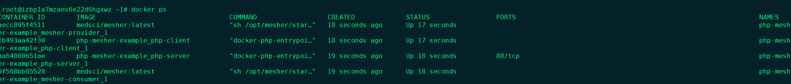
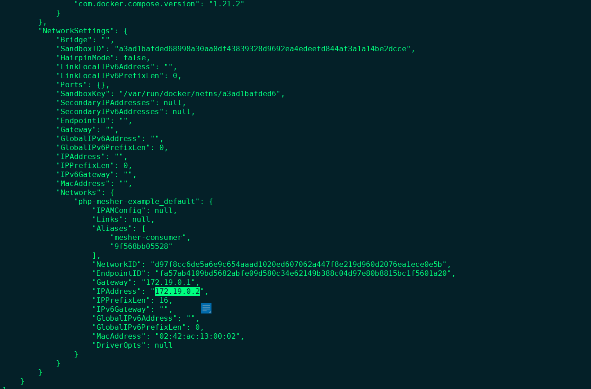

# medsci-mesher-examples
 示例内容： php作为微服务的provider，然后注册到注册中心，然后php作为consumer访问访问这个服务。

运行前提， 安装有docker和docker-compose，已经安装有注册中心.
1. 获取示例代码
   git clone https://github.com/msnetc/medsci-mesher-examples.git

2. 创建 medsci/mesher镜像
  
   cd medsci-mesher

   docker build -t medsci/mesher .

3. 创建运行时容器
   cd PHP-Mesher-Example/

   docker-compose up

   运行成功后的  docker ps
  
  

4. 在注册中心查看注册的微服务
   

6. 获取mesher客户端的ip地址, 例如图中的ip地址为172.19.0.2
   docker inspect php-mesher-example_mesher-consumer_1
   

7. 测试 curl http://172.19.0.2/client.php，返回10。成功。  